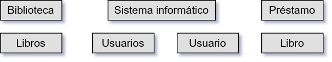
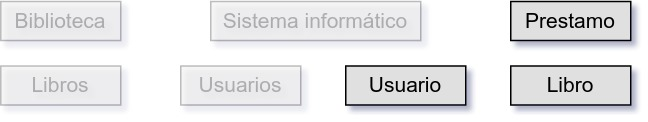
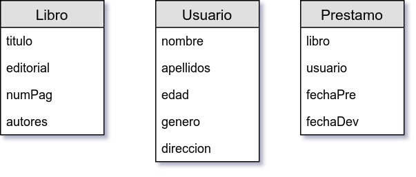

##### EJEMPLO-01
## OBTENIENDO EL MODELO PARA UNA BASE DE DATOS RELACIONAL

### OBJETIVO
Dados los requerimientos de un proyecto obtener un diagrama inicial del modelo de la bases de datos.

#### DESARROLLO
1. Obtener la descripción o requerimientos del proyecto, para este ejemplo se desarrollará el Proyecto Biblioteca.

   __Resultado__

   __Proyecto__: Biblioteca

   __Descipción__: En una biblioteca requiere de un sistema informático que pueda administrar el préstamo de libros a usuarios, cada libro tiene un título, editorial, número de páginas y un autores asociados.

   Para que un usuario pueda solicitar un préstamo, tiene primero que estar registrarse con los datos de nombre, apellidos, edad, género y dirección.

   Cuando un usuario esta registrado, puede tener en préstamo de 1 a 5 libros por un periodo máximo de 15 días.
   ***

2. Identificar los sustantivos en la descripción ya que son los mejores candidatos para convertirse en una tabla.

   __Resultado__

   __Proyecto__: Biblioteca

   __Descipción__: En una __biblioteca__ requiere de un __sistema informático__ que pueda administrar el __préstamo__ de __libros__ a __usuarios__, cada __libro__ tiene un `título`, `editorial`, `número de páginas` y `autores` asociados.

   Para que un __usuario__ pueda solicitar un __préstamo__, tiene primero que registrarse con los datos de `nombre`, `apellidos`, `edad`, `género` y `dirección`.

   Cuando un __usuario__ esta registrado, puede tener en __préstamo__ de 1 a 5 __libros__ por un periodo máximo de 15 `días`.

   ---

3. Definir una tabla por cada sustantivo encontrado.

   __Resultado__

   

   ---

4. Descartar las tablas que no almacenarán una única colección de datos, sólo dejar nombre de tablas en síngular y remplazar caracteres con acentuación, tildes o diéresis.

   __Resultado__

   

   ---

5. Agregar atributos a cada una de las tablas, en base a los sustantivos restantes, en caso de tener tablas sin sustantivos que agregar, entonces deducir los atributos que mejor representen a esa tabla y complemente a las demás. Considear que los nombres de los atributos van en minúsculas y tampoco se deben incluir caracteres del idioma español.

   __Resultado__

   Modelo de base de datos final

   

   ---
