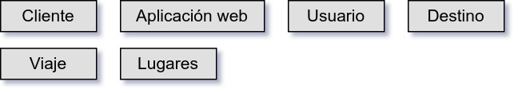
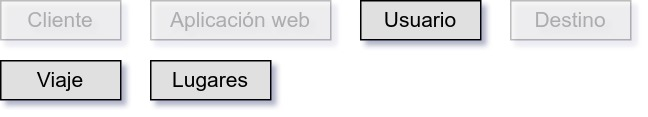
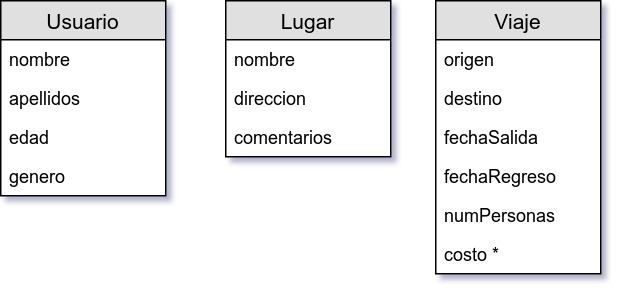

##### RETO-01
## OBTENER UN MODELO DE BASE DE DATOS

### OBJETIVO
Dados los requerimientos del proyecto __BeduTravels__ obtener un diagrama inicial del modelo de la bases de datos.

#### DESARROLLO
1. La descripción del proyecto BeduTravels proporcionada por el cliente es la siguiente.

   __Resultado__

   __Proyecto__: BeduTravels

   __Descipción__: Un cliente requiere de una aplicación web que permita a un usuario buscar un destino para agendar un viaje.

   El usuario deberá poder ver una lista de los lugares más populares, así como poder ordenar o filtrar los destinos por costo.

   El usuario deberá poder ver la información del viaje y contar con la opción de poder elegir el viaje, así como ajustar algunas otras opciones del mismo.
   ***

2. Identificar los sustantivos en la descripción ya que son los mejores candidatos para convertirse en una tabla.

   __Resultado__

   __Proyecto__: BeduTravels

   __Descipción__: Un __cliente__ requiere de una __aplicación web__ que permita a un __usuario__ buscar un __destino__ para agendar un __viaje__.

   El __usuario__ deberá poder ver una __lista__ de los __lugares__ más populares, así como poder ordenar o filtrar los __destinos__ por `costo`.

   El __usuario__ deberá poder ver la `información` del __viaje__ y contar con la opción de poder elegir el __viaje__, así como ajustar algunas otras `opciones` del mismo.
   ***

3. Definir una tabla por cada sustantivo encontrado.

   __Resultado__

   
   ***

4. Descartar las tablas que no almacenarán una única colección de datos, sólo dejar nombre de tablas en síngular y remplazar caracteres con acentuación, tildes o diéresis.

   __Resultado__

   
   ***

5. Agregar atributos a cada una de las tablas, en base a los sustantivos restantes, en caso de tener tablas sin sustantivos que agregar, entonces deducir los atributos que mejor representen a esa tabla y complemente a las demás. Considear que los nombres de los atributos van en minúsculas y tampoco se deben incluir caracteres del idioma español.

   __Resultado__

   Modelo de base de datos final

   
   ***
