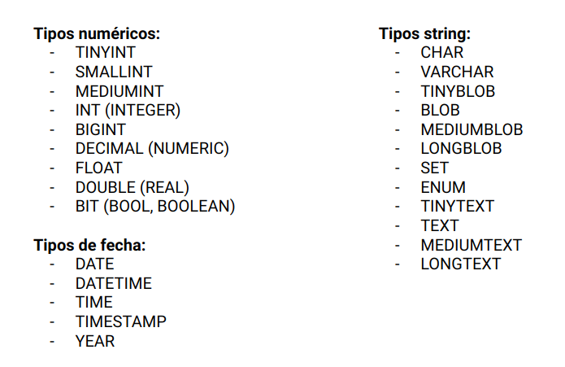

##### RETO-03
## CREANDO TABLAS EN MARIADB

### OBJETIVO
Usar la instrucción para crear una tabla en MariaDB, así como definir el tipo de dato para cada uno de los atributos.

#### REQUISITOS
1. Contar con la base de datos BeduTravels inicializada y con los datos de conexión:

   __Host:__ localhost \
   __User:__ BeduTravels \
   __Password:__ BeduTravels \
   __Base de datos:__ BeduTravels

2. Haber actualizado el contenido de la carpeta `CursoPythonBedu`
3. Abrir una terminal o consola de comandos y cambiarse a la carpeta de trabajo `CursoPythonBedu/Clase-05/Reto-03`

   ```sh
   $ cd Clase-05/Reto-03

   Clase-05/Reto-03 $ ls
   Readme.md

   Clase-05/Reto-03 $
   ```
   ***
4. Conocer los tipos de datos que se pueden manejar para los atributos en una tabla de MySQL / MariaDB

   A continuación se muestra una lista de los tipos de datos que es posible utilisar con MariaDB, sin embargo es bueno mirar en las páginas oficales de MariaDB o MySQL para consultar si un tipo de dato es soportado y que opciones y restriccione tiene.

   

   __Referencias:__
   1. https://mariadb.com/kb/en/library/data-types/
   2. https://dev.mysql.com/doc/refman/8.0/en/data-types.html
   3. https://disenowebakus.net/tipos-de-datos-mysql.php
   4. https://www.anerbarrena.com/tipos-dato-mysql-5024/

5. Contar con la definición de la tabla o tablas a crear, en este caso la tabla Usuario:

   


### DESARROLLO
1. La creación de tablas en SQL se realiza por medio de la instrucción __CREATE TABLE__ y a continuación se muestra la forma de usarla para crear la tabla __Usuario__ en la base de datos __BeduTravels__:

   __Resultado__

   ```bash
   Clase-05/Reto-03 $ docker exec -it pythonsql mysql -hlocalhost -uBiblioteca -p Biblioteca
   Enter password:
   Welcome to the MariaDB monitor.  Commands end with ; or \g.
   Your MariaDB connection id is 13
   Server version: 10.3.15-MariaDB-1:10.3.15+maria~bionic mariadb.org binary distribution

   Copyright (c) 2000, 2018, Oracle, MariaDB Corporation Ab and others.

   Type 'help;' or '\h' for help. Type '\c' to clear the current input statement.

   MariaDB [BeduTravels]> CREATE TABLE Usuario (id INTEGER PRIMARY KEY AUTO_INCREMENT, nombre VARCHAR(30), apellidos VARCHAR(60), edad INT, genero VARCHAR(1));
   Query OK, 0 rows affected (0.033 sec)

   MariaDB [BeduTravels]> DESCRIBE Usuario;
   +-----------+-------------+------+-----+---------+----------------+
   | Field     | Type        | Null | Key | Default | Extra          |
   +-----------+-------------+------+-----+---------+----------------+
   | id        | int(11)     | NO   | PRI | NULL    | auto_increment |
   | nombre    | varchar(30) | YES  |     | NULL    |                |
   | apellidos | varchar(60) | YES  |     | NULL    |                |
   | edad      | int(11)     | YES  |     | NULL    |                |
   | genero    | varchar(1)  | YES  |     | NULL    |                |
   +-----------+-------------+------+-----+---------+----------------+
   5 rows in set (0.001 sec)

   MariaDB [BeduTravels]>
   ```

   __Referencias:__
   1. https://mariadb.com/kb/en/library/create-table
   ***
