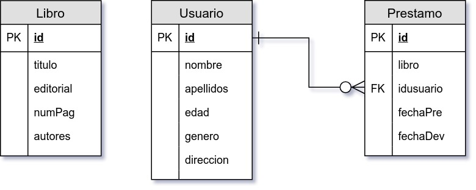
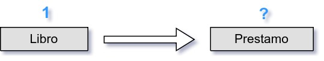
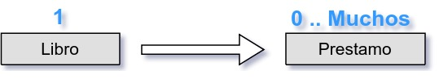
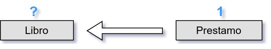
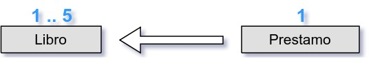
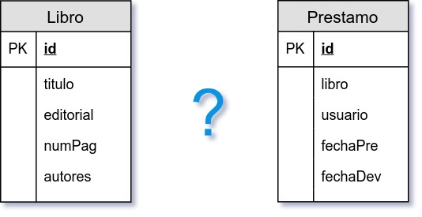
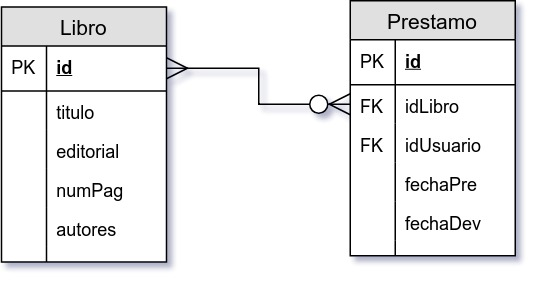
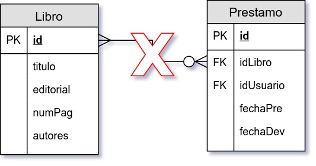
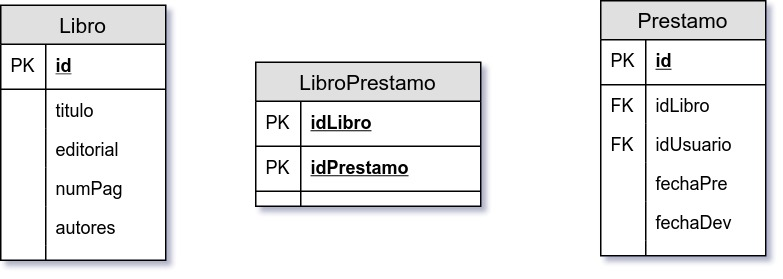
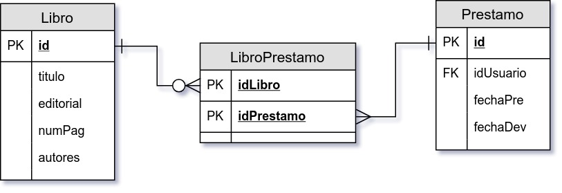

`Fullstack con Python` > [`Backend con Python`](../../Readme.md) > [`Sesión 06`](../Readme.md) > Ejemplo-02
## Definiendo una relación muchos a muchos para proyecto Biblioteca

### OBJETIVO
Dadas dos tablas y los requerimientos de un proyecto conocer el proceso para obtener un diagrama entidad-relación normalizado de la bases de datos.

#### REQUISITOS
1. Descripción del proyecto:

   En una biblioteca requiere de un sistema informático que pueda administrar el préstamo de libros a usuarios, cada libro tiene un título, editorial, número de páginas y un autores asociados.

   Para que un usuario pueda solicitar un préstamo, tiene primero que estar registrarse con los datos de nombre, apellidos, edad, género y dirección.

   Cuando un usuario esta registrado, puede tener en préstamo de 1 a 5 libros por un periodo máximo de 15 días.

1. Modelo de entidad-relación actual:

   

#### DESARROLLO
1. Encontrar la __cardinalidad__ entre la tabla __Libro__ y la tabla __Prestamo__.

   __Pregunta__

   ¿Un Libro con cuántos Préstamos está relacionado? 

   __Respuesta__

   Un Libro está relacionado con 0, 1, 2 o más Préstamos 

   __Pregunta__

   ¿Un Préstamo con cuántos Libros está relacionado? 

   __Respuesta__

   Un Préstamo está relacionado con 1, 2, hasta 5 Libros 
   ***

1. Definir la relación entre ambas tablas

   __Pregunta__

   ¿Cuál es el tipo de relación entra la tabla __Libro__ y la tabla __Prestamo__? 

   __Respuesta__

   Es una relación de muchos a muchos y en la notación __pata de gallo__ se representa de la siguiente forma: 

   __Pregunta__

   ¿Ya terminamos?

   __Respuesta__

   Noooooo! Una relación mucho a muchos en un modelo entidad-relación es lo peor que se puede dejar, ya que hacer un seguimiento de información tendría múltiples respuestas, por no decir casi infinitas! 
   ***

1. Debido a que tener relaciones muchos a muchos es una mala práctica, se aplica el proceso conocido como __normalización__ y eliminando la relación muchos a muchos y creando una tercer tabla como se muestra a continuación:

   

   La tercer tabla se construye de la siguiente forma:
   1. El nombre de la tabla se conforma por el nombre de ambas tablas, a menos quese tenga ya un nombre definido.
   1. La llave primaria de esta tabla está formada por dos id, uno por cada tabla y es la cantidad mínima de atributos que deberá contener esta tabla.
   1. En caso de ser necesario se pueden agregar más campos
   ***

1. El siguiente paso de la normalización consiste en definir las relaciones entre la tercer tabla y las tablas iniciales, además de eliminar el campo de la llave foranea (FK) de la tabla __Prestamo__.

   
   ***

1. El paso final es más de estrategia y consiste en reacomodar el diagrama, se recomienda colocar a la izquierda la tablas con cardinalidades fijas y a la derecha las tablas con cardinalidades muchos.

   
   ***
