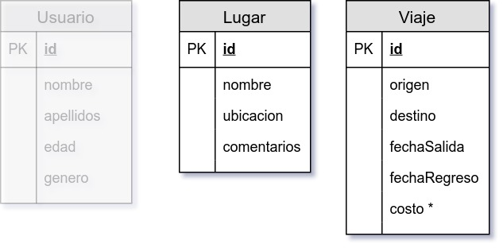
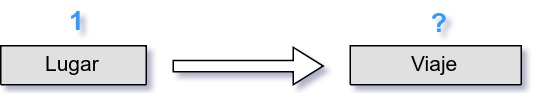
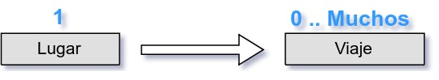
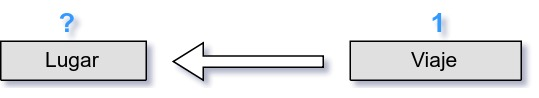
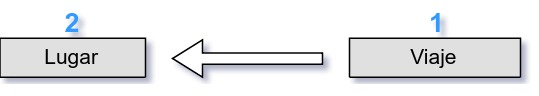
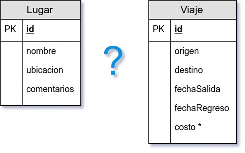
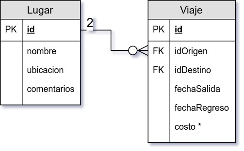

`Fullstack con Python` > [`Backend con Python`](../../Readme.md) > [`Sesión 06`](../Readme.md) > Reto-01
## Definiendo una relación uno a muchos para proyecto BeduTravels

### OBJETIVO
Dadas dos tablas y los requerimientos del proyecto BeduTravels, obtener un diagrama entidad-relación de la bases de datos.

#### REQUISITOS
1. Descripción del proyecto:

   Un cliente requiere de una aplicación web que permita a un usuario buscar un destino para agendar un viaje.

   El usuario deberá poder ver una lista de los lugares más populares, así como poder ordenar o filtrar los destinos por costo.

   El usuario deberá poder ver la información del viaje y contar con la opción de poder elegir el viaje, así como ajustar algunas otras opciones del mismo.

1. Modelo de tablas:

   

#### DESARROLLO
1. Para este reto considerar las tablas __Lugar__ y __Viaje__.
   ***

1. Encontrar la __cardinalidad__ entre la tabla __Lugar__ y la tabla __Viaje__.

   __Pregunta__

   ¿Un Lugar con cuántos Viajes está relacionado?    

   __Respuesta__

   Un Lugar está relacionado con 0, 1, 2 o más Viajes    

   __Pregunta__

   ¿Un Viaje con cuántos Lugares está relacionado?    

   __Respuesta__

   Un Viaje está relacionado con exactamente dos Lugares. 
   ***

1. Definir la relación entre ambas tablas

   __Pregunta__

   ¿Cuál es el tipo de relación entra la tabla __Lugar__ y la tabla __Viaje__? 

   __Respuesta__

   Es una relación de dos a cero o muchos y en la notación __pata de gallo__ se representa de la siguiente forma: 

   Además en la tabla con cardinalidad muchos, los campos de __origen__ y __destino__ se convierten en llaves foráneas (FK) __idOrigen__ y __idDestino__.
   ***
