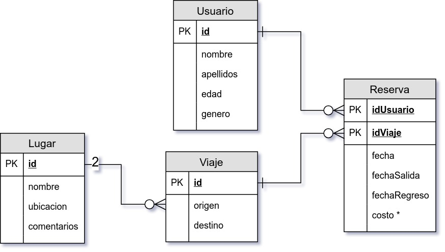
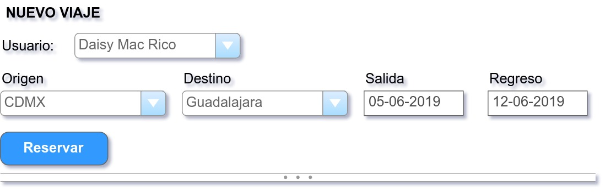

`Fullstack con Python` > [`Backend con Python`](../../Readme.md) > [`Sesión 06`](../Readme.md) > Reto-03
## Definiendo una relación muchos a muchos y actualizando datos con SQL

### OBJETIVO
 - Dado un modelo entidad-relación crear las tablas y sus relaciones con SQL para el proyecto BeduTravels.
 - Dado un formulario web agregar los datos a las tablas con SQL para el proyecto BeduTravels.


#### REQUISITOS
1. Modelo de entidad-relación:

   

1. Carpeta de repo actualizada
1. Usar la carpeta de trabajo `Clase-06/Reto-03`


#### DESARROLLO
1. Crea la tabla __Lugar__ usando el archivo `sql/tabla-lugar.sql`:

   ```bash
   Clase-06/Reto-03 $ docker exec -i mariadb mysql -hlocalhost -uBeduTravels -pBeduTravels BeduTravels < sql/tabla-lugar.sql

   Clase-06/Reto-03 $
   ```
   Si no hay mensajes de error, entonces el comando se ha ejecutado con éxito.

1. Crear las tablas __Viaje__ y __Reserva__:

   __Conectándose a la base de datos:__

    ```bash
    Clase-06/Reto-03 $ docker exec -it -e LANG=C.UTF-8 mariadb mysql -hlocalhost -uBeduTravels -pBeduTravels BeduTravels
    [...]
    MariaDB [BeduTravels]>
    ```

   __Creando la tabla Viaje:__

   ```sql
   CREATE TABLE Viaje (id INT PRIMARY KEY AUTO_INCREMENT, idOrigen INT NOT NULL, idDestino INT NOT NULL);
   Query OK, 0 rows affected (0.041 sec)
   ```

   __Creando la tabla Reserva:__

   ```sql
   CREATE TABLE Reserva (idUsuario INT NOT NULL, idViaje INT NOT NULL, fecha DATE, fechaSalida Date, fechaRegreso DATE, PRIMARY KEY (idUsuario, idViaje));
   Query OK, 0 rows affected (0.036 sec)
   ```

   __Validando la creación de las tablas:__

   ```sql
   DESCRIBE Viaje;
   +-----------+---------+------+-----+---------+----------------+
   | Field     | Type    | Null | Key | Default | Extra          |
   +-----------+---------+------+-----+---------+----------------+
   | id        | int(11) | NO   | PRI | NULL    | auto_increment |
   | idOrigen  | int(11) | NO   |     | NULL    |                |
   | idDestino | int(11) | NO   |     | NULL    |                |
   +-----------+---------+------+-----+---------+----------------+
   3 rows in set (0.001 sec)

   DESCRIBE Reserva;
   +--------------+---------+------+-----+---------+-------+
   | Field        | Type    | Null | Key | Default | Extra |
   +--------------+---------+------+-----+---------+-------+
   | idUsuario    | int(11) | NO   | PRI | NULL    |       |
   | idViaje      | int(11) | NO   | PRI | NULL    |       |
   | fecha        | date    | YES  |     | NULL    |       |
   | fechaSalida  | date    | YES  |     | NULL    |       |
   | fechaRegreso | date    | YES  |     | NULL    |       |
   +--------------+---------+------+-----+---------+-------+
   5 rows in set (0.001 sec)
   ```
   ***

1. Agregar los datos del siguiente formulario a las tablas __Viaje__ y __Reserva__:

   __Fomulario:__

   

   __Agregando datos a la tabla Viaje:__

   ```sql
   INSERT INTO Viaje VALUES (null, 1, 3);
   Query OK, 1 row affected (0.001 sec)
   ```

   __Agregando datos a la tabla Reserva:__

   ```sql
   INSERT INTO Reserva VALUES (3, 1, "2019-06-05", "2019-06-05", "2019-06-12");
   Query OK, 1 row affected (0.001 sec)
   ```

   __Validando resultados:__

   ```sql
   SELECT * FROM Viaje;
   +----+----------+-----------+
   | id | idOrigen | idDestino |
   +----+----------+-----------+
   |  1 |        1 |         3 |
   +----+----------+-----------+
   1 row in set (0.000 sec)

   SELECT * FROM Reserva;
   +-----------+---------+------------+-------------+--------------+
   | idUsuario | idViaje | fecha      | fechaSalida | fechaRegreso |
   +-----------+---------+------------+-------------+--------------+
   |         3 |       1 | 2019-06-05 | 2019-06-05  | 2019-06-12   |
   +-----------+---------+------------+-------------+--------------+
   1 row in set (0.000 sec)
   ```
